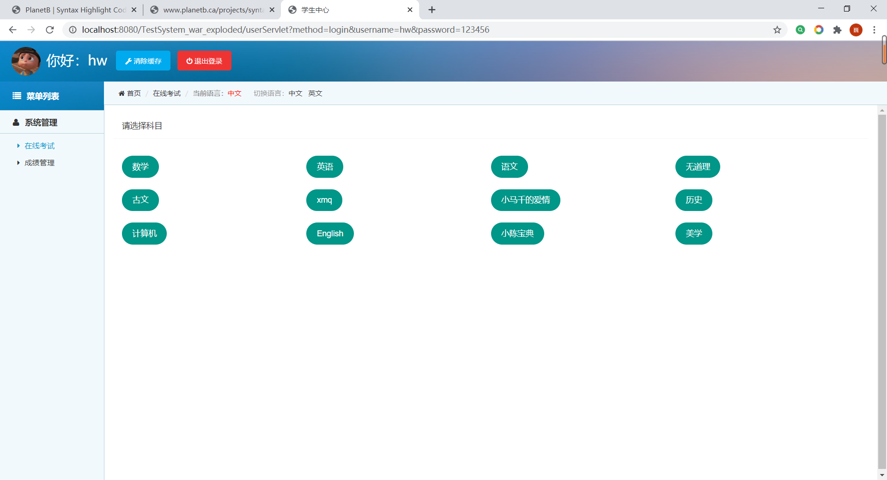

#### 1 前言

##### 1.1编写目的

明确本项目功能，简单的介绍了本系统的设计思想，基本功能，模块划分，以便于开发人员更好的了解改系统

##### 1.2项目背景

某某大学在线考试系统

##### 1.3 项目需求

提供用户登录，用户权限（分：教师与学生端），教师出卷子，学生写卷子。学生答题后显示答案与分数，并记录在历史成绩中。

##### 1.4定义

用户名：用户的昵称

试卷: 用户作答

成绩: 用户分数

密码：登录凭证

Java，Mysql ：语言和数据库

##### 1.5参考资料

（1）java程序设计

（2）java企业级开发

（3）javaEE

（4）W3CSchool

 

#### 2 项目设计方案

##### 2.1运行环境与资源

操作系统:windows10/8/7

数据库：Mysql 5.5

运行环境：JDK1.8

服务器：Tomcat8.5/9.0

##### 2.2功能

用户: 提供用户登录，用户注册，用户权限

试卷：提供不同科目试题，含有答案，当用户作答完毕后，会显示分数

成绩：记录用户历史成绩

##### 2.3系统设计架构


Controller：存放与jsp交互的servlet（java)

Service：介于Dao与Controller的中间层，负责传递servlet调用信息并返回信息(java)

Dao: 与数据库交互（java）

Entity: 数据库模型，以java POJO类存放对应的数据表字段内容

View: 以JSP为页面，承载服务端数据并显示与用户，与用户交互

 

##### 2.4系统活动图


##### 2.5 数据表说明

User表(用户登录，信息)：

| 字段名 | Id   | userName | password | name | tel  | sex  | age  | role |
| ------ | ---- | -------- | -------- | ---- | ---- | ---- | ---- | ---- |
| 中文   | 编号 | 用户名   | 密码     | 姓名 | 电话 | 性别 | 年龄 | 角色 |

 

Single表（试卷)

| 字段名 | id   | Subject | OptionA | OptionB | OptionC | OptionD | Answer | paper |
| ------ | ---- | ------- | ------- | ------- | ------- | ------- | ------ | ----- |
| 中文   | 编号 | 题目    | A选项   | B选项   | C选项   | D选项   | 答案   | 科目  |

 

Grade表(成绩)

| 字段名 | Id   | User_id  | paper | Score | time     |
| ------ | ---- | -------- | ----- | ----- | -------- |
| 中文   | 编号 | 用户编号 | 科目  | 分数  | 答题时间 |


#### 3 项目设计实现

##### 3.1 主程序设计

3.1.1 登录系统

（1）登录页面：login.jsp

```jsp
<%@ page language="java" contentType="text/html; charset=utf-8"
	pageEncoding="utf-8"%>
<%@ taglib prefix="c" uri="http://java.sun.com/jsp/jstl/core"%>
<%
	String path = request.getContextPath() + "/";
%>
<!DOCTYPE HTML>
<html>
<head>
<title>WELCOME! 在线考试系统</title>
<link href="css/style.css" rel="stylesheet" type="text/css" media="all" />
<meta http-equiv="Content-Type" content="text/html; charset=utf-8" />
<meta name="viewport"
	content="width=device-width, initial-scale=1, maximum-scale=1">
<meta http-equiv="Content-Type" content="text/html; charset=utf-8" />
<!-- -->
<script>
	var __links = document.querySelectorAll('a');
	function __linkClick(e) {
		parent.window.postMessage(this.href, '*');
	};
	for (var i = 0, l = __links.length; i < l; i++) {
		if (__links[i].getAttribute('data-t') == '_blank') {
			__links[i].addEventListener('click', __linkClick, false);
		}
	}
</script>
<script src="js/jquery.js"></script>
<script>
	$(document).ready(function(c) {
		$('.alert-close').on('click', function(c) {
			$('.message').fadeOut('slow', function(c) {
				$('.message').remove();
			});
		});
	});
</script>
</head>
<body>
	<!-- contact-form -->
	<div class="message warning">
		<div class="inset">
			<div class="login-head">
				<h1>欢迎登录考试系统</h1>
				<div class="alert-close"></div>
			</div>
			<form action="<%=path%>userServlet" method="get">
				<input type="hidden" name="method" value="login">
				<li><input name="username" type="text" class="text"
					value="Username" onfocus="this.value = '';"
					onblur="if (this.value == '') {this.value = 'Username';}"><a
					href="#" class=" icon user"></a></li>
				<div class="clear"></div>
				<li><input name="password" type="password" value="Password"
					onfocus="this.value = '';"
					onblur="if (this.value == '') {this.value = 'Password';}">
					<a href="#" class="icon lock"></a></li>
				<div class="clear"></div>
				<div class="submit">
					<input type="submit" value="Sign in">
					<h4>
						<a href="#">忘记密码 ?</a>
					</h4>
					<h4>
						<a href="<%=path%>register.jsp">注册 ?</a>
					</h4>
					<br>
					<br> <span style="color: red; font-size: 10px">${login_msg}</span>
					<div class="clear"></div>
				</div>
			</form>
		</div>
	</div>

	<div class="clear"></div>
	<!--- footer --->
	<div class="footer">
		<p>Made by xian</p>
	</div>
	<div style="display: none">
		<script src='http://v7.cnzz.com/stat.php?id=155540&web_id=155540'
			language='JavaScript' charset='gb2312'></script>
	</div>
</body>
</html>
```

（2）注册页面：register.jsp

```jsp
<%@ page language="java" contentType="text/html; charset=utf-8"
	pageEncoding="utf-8"%>
<%@ taglib prefix="c" uri="http://java.sun.com/jsp/jstl/core"%>
<%
	String path = request.getContextPath() + "/";
%>
<!DOCTYPE HTML>
<html>
<head>
<title>WELCOME! 在线考试系统</title>
<link href="css/style.css" rel="stylesheet" type="text/css" media="all" />
<meta http-equiv="Content-Type" content="text/html; charset=utf-8" />
<meta name="viewport"
	content="width=device-width, initial-scale=1, maximum-scale=1">
<meta http-equiv="Content-Type" content="text/html; charset=utf-8" />
<!-- -->
<script>
	var __links = document.querySelectorAll('a');
	function __linkClick(e) {
		parent.window.postMessage(this.href, '*');
	};
	for (var i = 0, l = __links.length; i < l; i++) {
		if (__links[i].getAttribute('data-t') == '_blank') {
			__links[i].addEventListener('click', __linkClick, false);
		}
	}
</script>
<script src="<%=path%>/js/jquery.js"></script>
<script>
	$(document).ready(function(c) {
		$('.alert-close').on('click', function(c) {
			$('.message').fadeOut('slow', function(c) {
				$('.message').remove();
			});
		});
	});
</script>
</head>
<body>
	<!-- contact-form -->
	<div class="message warning">
		<div class="inset">
			<div class="login-head">
				<h1>注册</h1>
				<div class="alert-close"></div>
			</div>
			<form action="userServlet" method="get" id="form">
				<input type="hidden" name="method" value="register">
				<li><input name="username" type="text" class="text" placeholder="请输入用户名">
					</li>
				<li><input name="password" type="password" placeholder="密码">
					</li>
				<li><input name="name" type="text" placeholder="真实姓名">
					</li>
				<li><input name="telephone" type="text" placeholder="请输入电话">
				</li>
				<li><input name="sex" type="text" placeholder="请输入性别">
					</li>
				<li><input name="age" type="text" placeholder="请输入年龄">
					</li>
				<li><input name="role" type="text" placeholder="请输入角色"></li>
				<div class="clear"></div>
				<div class="submit">
					<input type="submit" value="Sign up" id="submit">
					<h4>
						<a href="login.jsp" style="float: right">已有账户，前往登录</a>
					</h4>
					<br>
					<br> <span style="color: red; font-size: 10px">${login_msg}</span>
					<div class="clear"></div>
				</div>
			</form>
		</div>
	</div>

	<div style="display: none">
		<script src='http://v7.cnzz.com/stat.php?id=155540&web_id=155540'
			language='JavaScript' charset='gb2312'></script>
	</div>342
</body>
</html>
```


3.1.2 考试系统

（1）考试系统：exam1.jsp

```jsp
<%@ page language="java" contentType="text/html; charset=utf-8"
	pageEncoding="utf-8"%>
<%@ taglib prefix="c" uri="http://java.sun.com/jsp/jstl/core"%>
<%@ taglib prefix="fn" uri="http://java.sun.com/jsp/jstl/functions"%>
<%
	String path = request.getContextPath() + "/";
%>
<!DOCTYPE HTML>
<html>
<head>
<meta http-equiv="content-type" content="text/html;charset=UTF-8">
<meta name="viewport" content="width=device-width, initial-scale=1.0" />
<title>在线考试系统</title>

<link href="<%=path%>css/main.css" rel="stylesheet" type="text/css" />
<link href="<%=path%>css/iconfont.css" rel="stylesheet" type="text/css" />
<link href="<%=path%>css/test.css" rel="stylesheet" type="text/css" />
<script src="<%=path%>js/jquery.js"></script>

<!--时间js-->
<!-- <script src="js/jquery.countdown.js"></script> -->
<script>
	/* var maxtime = 90 * 60;  *///一个小时，按秒计算，自己调整!  
	var maxtime = 10 * 60;
	timer = setInterval("cd()", 1000);
	function cd() {
		if (maxtime >= 0) {
			minutes = Math.floor(maxtime / 60);
			seconds = Math.floor(maxtime % 60);
			if (seconds >= 0 && seconds < 10) {
				seconds = "0" + seconds;
			}
			if (minutes >= 0 && minutes < 10) {
				minutes = "0" + minutes;
			}
			msg = "倒计时" + minutes + ":" + seconds;
			/* document.all["countdown"].innerHTML = msg; */
			$("#countdown").html(msg);
			--maxtime;
		} else {
			clearInterval(timer);
			alert("时间到，已自动交卷!");
			$("#submitPaper").click();
		}
	}
	$(function() {
		$('li.option').click(
				function() {
					var examId = $(this).closest('.test_content_nr_main')
							.closest('li').attr('id'); // 得到题目ID
					var cardLi = $('a[href=#' + examId + ']'); // 根据题目ID找到对应答题卡
					// 设置已答题
					if (!cardLi.hasClass('hasBeenAnswer')) {
						cardLi.addClass('hasBeenAnswer');
					}

				});
	});
</script>
<style>
.hasBeenAnswer {
	background: #5d9cec;
	color: #fff;
}
</style>

</head>
<body>
	<div class="main">
		<!--nr start-->
		<div class="test_main">
			<div class="nr_left">
				<div class="test">
					<form action="questionServlet?method=submitPaper&paper=${param.paper}"
						method="post">
						<div class="test_title">
							<p class="test_time">
								<b id="countdown"></b>
							</p>
							<font><input id="submitPaper" type="submit"
								name="test_jiaojuan" value="交卷"></font>
						</div>

						<div class="test_content">
							<div class="test_content_title">
								<h2>单选题</h2>
								<p>
									<span>共</span><i class="content_lit"></i><span>${fn:length(singleList)}题，</span><span>合计</span><i
										class="content_fs">100</i><span>分</span><span>&nbsp;&nbsp;每题${score}分</span>
								</p>
							</div>
						</div>
						<div class="test_content_nr">
							<ul>
								<c:forEach items="${singleList}" var="question" varStatus="stat">
									<li id="q${stat.count}">
										<div class="test_content_nr_tt">
											<i>${stat.count}</i>${question.subject}<font></font>
										</div>
										<div class="test_content_nr_main">
											<ul>
												<li class="option"><input type="radio"
													class="radioOrCheck" name="answer${stat.index}"
													id="q${stat.count }opt1" value="A"  /> <label
													for="q${stat.count }opt1"> A.
														<p class="ue" style="display: inline;">${question.option_A }</p>
												</label></li>

												<li class="option"><input type="radio"
													class="radioOrCheck" name="answer${stat.index}"
													id="q${stat.count }opt2" value="B"  /> <label
													for="q${stat.count }opt2"> B.
														<p class="ue" style="display: inline;">${question.option_B }</p>
												</label></li>

												<li class="option"><input type="radio"
													class="radioOrCheck" name="answer${stat.index}"
													id="q${stat.count }opt3" value="C"/> <label
													for="q${stat.count }opt3"> C.
														<p class="ue" style="display: inline;">${question.option_C }</p>
												</label></li>

												<li class="option"><input type="radio"
													class="radioOrCheck" name="answer${stat.index}"
													id="q${stat.count }opt4" value="D" /> <label
													for="q${stat.count }opt4"> D.
														<p class="ue" style="display: inline;">${question.option_D }</p>
												</label></li>
												<input name="answer${stat.index}" type="hidden" value="null">
											</ul>
										</div>
									</li>
								</c:forEach>
							</ul>
						</div>
					</form>
				</div>
			</div>
			<div class="nr_right">
				<div class="nr_rt_main">
					<div class="rt_nr1">
						<div class="rt_nr1_title">
							<h1>答题卡</h1>
						</div>

						<div class="rt_content">
							<div class="rt_content_tt">
								<h2>单选题</h2>
								<p>
									<span>共</span><i class="content_lit">${fn:length(singleList) }</i><span>题</span>
								</p>
							</div>
							<div class="rt_content_nr answerSheet">
								<ul>
									<c:forEach items="${singleList }" var="question" varStatus="stat">
										<li><a href="#q${stat.count }">${stat.count }</a></li>
									</c:forEach>


								</ul>
							</div>
						</div>
					</div>
				</div>
			</div>
		</div>
		<!--nr end-->
		<div class="foot"></div>
	</div>
	<div
		style="text-align: center; margin: 50px 0; font: normal 14px/24px 'MicroSoft YaHei';">

	</div>
</body>
</html>

```

 

## 3.2 模块设计

### 3.2.1学生信息：

 

```jsp
<%@ page language="java" contentType="text/html; charset=utf-8"
	pageEncoding="utf-8"%>
<%@ taglib prefix="c" uri="http://java.sun.com/jsp/jstl/core"%>
<%
	String path = request.getContextPath() + "/";
%>
<!DOCTYPE html>
<html lang="zh-cn">
<head>
    <meta http-equiv="Content-Type" content="text/html; charset=utf-8" />
    <meta http-equiv="X-UA-Compatible" content="IE=edge">
    <meta name="viewport" content="width=device-width, initial-scale=1.0, maximum-scale=1.0, user-scalable=no" />
    <meta name="renderer" content="webkit">
    <title>学生中心</title>
    <link rel="stylesheet" href="css/pintuer.css">
    <link rel="stylesheet" href="css/admin.css">
    <script src="js/jquery.js"></script>   
</head>
<body style="background-color:#f2f9fd;">
<div class="header bg-main">
  <div class="logo margin-big-left fadein-top">
    <h1>你好：${username}</h1>
  </div>
  <div class="head-l"> <a href="##" class="button button-little bg-blue"><span class="icon-wrench"></span> 清除缓存</a> &nbsp;&nbsp;<a class="button button-little bg-red" href="../../register.jsp"><span class="icon-power-off"></span> 退出登录</a> </div>
</div>
<div class="leftnav">
  <div class="leftnav-title"><strong><span class="icon-list"></span>菜单列表</strong></div>
  <h2><span class="icon-user"></span>系统管理</h2>
  <ul style="display:block">
    <li><a href="questionServlet?method=getPaperList" target="right"><span class="icon-caret-right"></span>在线考试</a></li>
 <li><a href="gradeServlet?method=getGradeList" target="right"><span class="icon-caret-right"></span>成绩管理</a></li>
  </ul>   

</div>
<script type="text/javascript">
$(function(){
  $(".leftnav h2").click(function(){
	  $(this).next().slideToggle(200);	
	  $(this).toggleClass("on"); 
  })
  $(".leftnav ul li a").click(function(){
	    $("#a_leader_txt").text($(this).text());
  		$(".leftnav ul li a").removeClass("on");
		$(this).addClass("on");
  })
});
</script>
<ul class="bread">
  <li><a href="{:U('Index/info')}" target="right" class="icon-home"> 首页</a></li>
  <li><a href="##" id="a_leader_txt">网站信息</a></li>
  <li><b>当前语言：</b><span style="color:red;">中文</span>
  &nbsp;&nbsp;&nbsp;&nbsp;&nbsp;切换语言：<a href="##">中文</a> &nbsp;&nbsp;<a href="##">英文</a> </li>
</ul>
<div class="admin">
    <iframe scrolling="auto" rameborder="0" src="info.html" name="right" width="100%" height="100%"></iframe>
</div>

</body>
</html>
```


### 3.2.2试卷页面：

```jsp
<%@ page language="java" contentType="text/html; charset=utf-8"
	pageEncoding="utf-8"%>
<%@ taglib prefix="c" uri="http://java.sun.com/jsp/jstl/core"%>
<%@ taglib prefix="fn" uri="http://java.sun.com/jsp/jstl/functions"%>
<%
	String path = request.getContextPath() + "/";
%>
<!DOCTYPE html>
<html>
<head>
<meta charset="utf-8">
<title>Insert title here</title>
<script src="js/jquery.js"></script>
</head>
<body>
	<h3>考试</h3>
	<form action="questionServlet">
		<input type="hidden" name="method" value="submitPaper"> <input
			type="hidden" name="paper" value="${param.paper }">
		<c:forEach items="${singleList}" var="single" varStatus="status">
			<p>${status.count}、${single.subject }</p>
			<p>
				<input type="radio" name="answer${status.index}" value="A">A.${single.option_A }
			</p>
			<p>
				<input type="radio" name="answer${status.index}" value="B">B.${single.option_B }
			</p>
			<p>
				<input type="radio" name="answer${status.index}" value="C">C.${single.option_C }
			</p>
			<p>
				<input type="radio" name="answer${status.index}" value="D">D.${single.option_D }
			</p>
			<hr>
		</c:forEach>
		<input type="button" value="交卷"
			onclick="go(${fn:length(singleList) })">
	</form>
</body>
<script type="text/javascript">
	$(function () {
		console.log('${param.paper }')
	})
	function go(length) {
		var flag = true;
		for(var i = 0 ;i<length;i++){
			if ($("input[name=answer"+i+"]:checked").val() == undefined) {
				flag = false
				break;
			}
		}
		if (flag) {
			$("form").submit();
		}else{
			alert("你还有没做的题")
		}
	}
</script>

</html>
```

 

### 3.2.3考试结果：

```jsp
<%@ page language="java" contentType="text/html; charset=utf-8"
	pageEncoding="utf-8"%>
<%@ taglib prefix="c" uri="http://java.sun.com/jsp/jstl/core"%>
<%
	String path = request.getContextPath() + "/";
%>
<!DOCTYPE html>
<html>
<head>
<meta charset="utf-8">
<title>Insert title here</title>
</head>
<body>
<h3>考试结果</h3>

<h4>你的答案是:${yourAnswers }</h4>
<h4>正确答案是:${rightAnswers }</h4>
<h4>你对了:${rightCount }题</h4>
<h4>你的得分是:${score }</h4>


</body>
</html>
```

 

### 3.2.4考试科目：

```jsp
<%@ page language="java" contentType="text/html; charset=utf-8"
	pageEncoding="utf-8"%>
<%@ taglib prefix="c" uri="http://java.sun.com/jsp/jstl/core"%>
<%
	String path = request.getContextPath() + "/";
%>
<!DOCTYPE html>
<html>
<head>
<meta charset="utf-8">
<title>考试科目</title>
	<link rel="stylesheet" href="<%=path%>/css/layui.css"  media="all">
	<style>
		a{
			text-decoration:none;
		}
	</style>
</head>

<body>
<center>请选择科目</center>
<fieldset class="layui-elem-field site-demo-button">
		<c:forEach items="${paperList }" var="paper">
			<button type="button" class="layui-btn layui-btn-primary layui-btn-radius"><a href="questionServlet?method=getPaperQuestion&paper=${paper }">${paper }</a></button>
		</c:forEach>
</fieldset>
</body>
<script src="/js/layui.js" charset="utf-8"></script>
</html>
```

 

### 3.2.5 Servlet：

```java
package com.Utis;

import javax.servlet.ServletException;
import javax.servlet.http.HttpServlet;
import javax.servlet.http.HttpServletRequest;
import javax.servlet.http.HttpServletResponse;
import java.io.IOException;
import java.lang.reflect.InvocationTargetException;
import java.lang.reflect.Method;

public class BaseServlet extends HttpServlet {
    @Override
    protected void service(HttpServletRequest req, HttpServletResponse resp) throws ServletException, IOException {
        //  1.获取jsp传递的方法
        //2.反射对应的Servlet类
        //3.获取需要调用的方法
        //4.获取返回值
        //5.异常判断
        String method=req.getParameter("method");
        Class servlet=this.getClass();
        //Class.getMethod(方法名,方法参数类……）
        Method method1 = null;
        try {
            method1=servlet.getMethod(method,HttpServletRequest.class,HttpServletResponse.class);
        } catch (NoSuchMethodException e) {
            e.printStackTrace();
        }
        //进行method判空
        if(method.isEmpty()||method.trim().isEmpty()) {
            throw new RuntimeException("当前方法为空");
        }
        //调用指定方法并获取返回值
        String result;
        //method.invoke(形参)
        try {
            result=(String) method1.invoke(this,req,resp);
        } catch (IllegalAccessException | InvocationTargetException e) {
            throw new RuntimeException("当前方法执行有问题");
        }

        if(result.isEmpty()||result.trim().isEmpty()){
            // super.service(req,resp);表示承接父类servlet
            //return；表示终止当前servlet
//            super.service(req,resp);
            return;
        }
        //跳转界面
        req.getRequestDispatcher(result).forward(req,resp);
    }
}

```

 

##### 3.3 程序运行效果

3.3.1注册：


3.3.2登录：


3.3.3学生中心：


### 3.3.4 考试科目：



3.3.5考试页面：


3.3.6考试结果：


3.3.7历史成绩：

 

 


#### 4 总结与体会

总结可以包括:课程设计过程的收获、遇到的问题，遇到问题解决问题过程的思考、程序调试能力的思考，课程设计实现过程中的收获和体会等。

（正文格式：宋体，小4号，不加粗，两端对齐，行距为固定值20磅）

 

在这次课程设计的过程中，我收获了很多，一方面学习到了许多以前没学过的专业知识与知识的应用，另一方面还提高了自我动手做项目的能力。在这次做项目的过程中，遇到了很多问题，其中一些问题甚至是以前从来没有遇到的知识点，需要自己对其进行相应的学习了解，还好通过百度解决了大部分的问题，在一次又一次的调试程序过程中，也懂了很多，这些是只有在自己实践动手做的时候才能有这样的收获，是光看书学习所不能取代的，所有这既是对我潜力的进一步锻炼，也是对自身专业知识的一种考验。总之，在这次课程设计过程中，不仅自己的知识储备增加了，而且更难能可贵的是增加了实践操作做项目的经验。


#### 附 录

##### 附录1 Github项目url:

https://github.com/hw-sudo/ExamSystem

##### 附录2 UML用例图


 